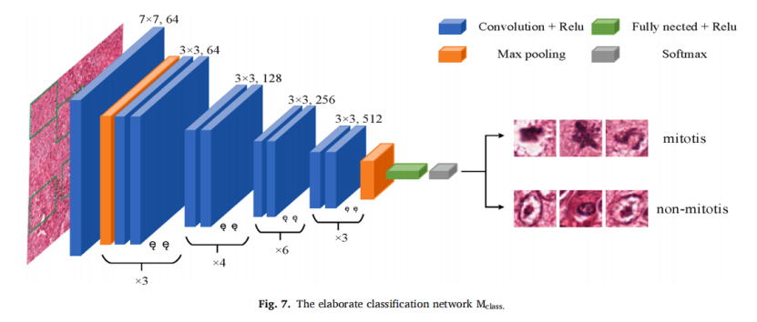

# FoCasNet

This repository is the PyTorch code for the paper 'A novel dataset and a two-stage mitosis nuclei detection method based on 
hybrid anchor branch'
[[Paper]](https://www.sciencedirect.com/science/article/pii/S1746809423008078)

## Abstract
<div align="center">
  
</div>
<div align="center">
  
</div>
<div align="center">
  
</div>

Mitosis detection is one of the important problems in computational pathology, 
and mitotic count is an important index of breast cancer grading for pathologists. 
However, the current count of mitotic nuclei relies on pathologists observing the number of mitotic nuclei in hotspots under a microscope, 
which is subjective and time consuming. In this paper, we propose a two-stage cascaded network, named FoCasNet, for mitosis detection. In the first stage, 
a detection network is proposed to screen as many candidates as possible. In the second stage, a classification network is proposed to refine the results of the first stage. In addition, the attention mechanism, 
normalization method, and hybrid anchor branch classification subnet are introduced to improve the overall detection performance. Our method achieves the current highest F1-score of 0.888 on the public dataset ICPR 2012. 
We also evaluated our method on the GZMH dataset released by our research group for the first time and reached the highest F1-score of 0.563, which is also better than the state-of-the-art detection networks. 
It confirmed the effectiveness and generalization of our method. 


## Training on ICPR 2012 with mmdetection

### Stage 1: Downloading Dataset

```
Please download the retina image datasets(ICPR 2012 and GZMH) to mmdetection-master/data and convert the dataset to VOC format
The data in VOC format is cut into 224*224 patches and stored in the HPF floder
GZMH dataset is at https://www.scidb.cn/en/detail?dataSetId=da31601544ce42ec8badf85b689f64d2
```
### Stage 2: train

```
cd root/Code/mmdetection-master
python ./tools/train.py /root/Code/mmdetection-master/configs/fsaf/fsaf_r50_fpn_1x_coco.py
```
### Stage 3: predict

```
cd root/Code/mmdetection-master
python predict.py
```


## Training on ICPR 2012 with mmclassification

### Stage 1: Downloading Dataset

```
Please download the retina image dataset(ICPR 2012) to mmclassification-master/data
```
### Stage 2: train

```
cd root/Code/mmclassification-master
python ./tools/train.py /root/Code/mmclassification-master/configs/resnet/resnet34_8xb32_in1k.py
```
### Stage 3: predict

```
cd root/Code/mmclassification-master
python predict.py
```


## Citation
If you think this repo and the manuscript helpful, please consider citing us.
```
@inproceedings{
  title={A novel dataset and a two-stage mitosis nuclei detection method based on hybrid anchor branch},
  author={Wang Huadeng, Xu Hao, Li Bingbing, Pan Xipeng},
  booktitle={Biomedical Signal Processing and Control},
  year={2024},
}
```


